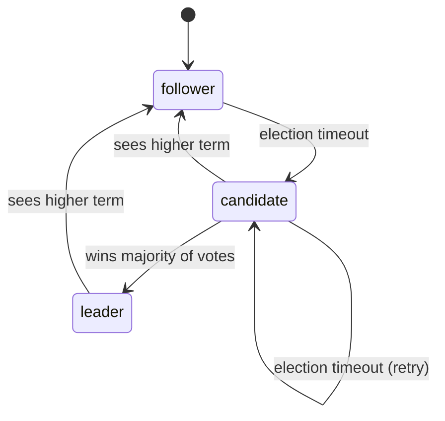
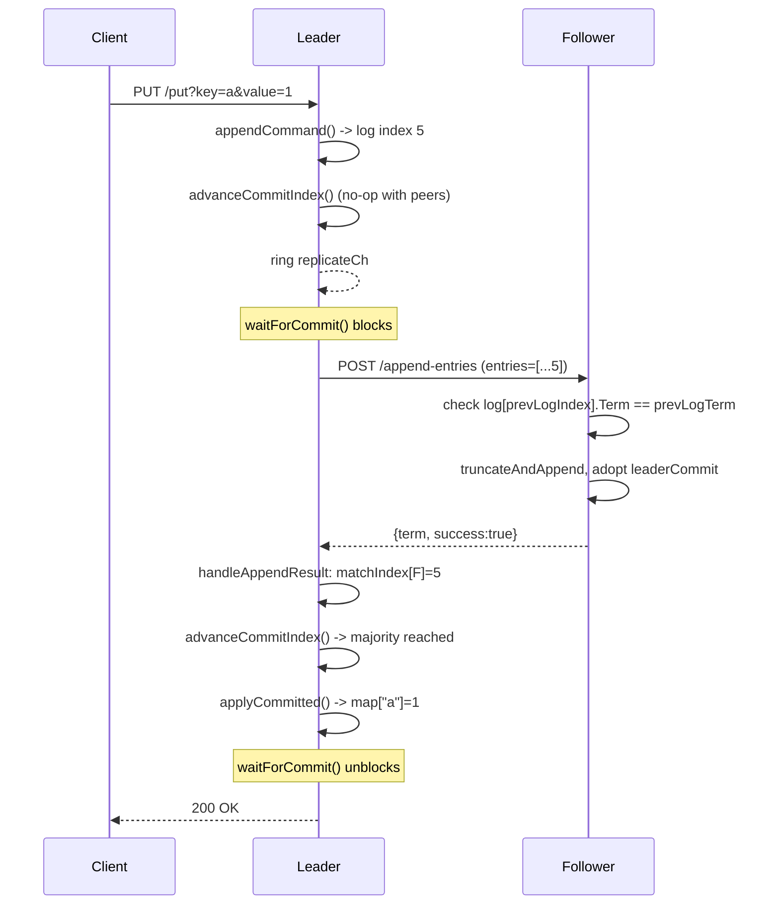

# distkvstore

A distributed key/value store in Go, built on a from-scratch implementation
of the [Raft consensus algorithm](https://raft.github.io/raft.pdf). This is
a **learning project** — the goal was to understand distributed consensus
deeply, not to build a production system. It does not cut corners on the
core algorithm (leader election, log replication, majority commit), but it
deliberately skips everything the [Raft paper](https://raft.github.io/raft.pdf)
treats as a separate concern (cluster membership changes, snapshotting,
linearizable reads).

**What works:** leader election with randomized timeouts, heartbeats,
failover, crash-safe persistence of vote state, and full log replication —
a write is only acknowledged once a majority of the cluster has durably
stored it.

**What doesn't (yet):** the replicated log itself lives in memory only. See
[Limitations](#limitations) and [TODO.md](TODO.md) for the complete,
current list of gaps.

---

## Quick start

```bash
go build .
```

Run a 3-node cluster, one node per terminal:

```bash
# terminal 1
./distkvstore -addr :8080 -id node1 -peers localhost:8081,localhost:8082

# terminal 2
./distkvstore -addr :8081 -id node2 -peers localhost:8080,localhost:8082

# terminal 3
./distkvstore -addr :8082 -id node3 -peers localhost:8080,localhost:8081
```

Each node writes its persisted state to `data/<id>.state.json` by default
(created automatically). Within a few seconds one node's log will print
`won election for term 1 ... -> leader`.

## Using it

A fourth terminal, once the cluster above is running:

```bash
# Ask any node who it thinks the leader is.
curl localhost:8080/ping
# {"id":"node1","addr":":8080","role":"follower","term":1,"voted_for":"node3","leader_id":"node3"}

# Write to the leader (substitute whichever port won the election).
curl "localhost:8082/put?key=hello&value=world"
# OK

# Read it back from a DIFFERENT node -- this is the replication working.
curl "localhost:8080/get?key=hello"
# world

# Writing to a non-leader is rejected, and told where the leader is.
curl -s -w '\n%{http_code}\n' "localhost:8080/put?key=x&value=1"
# {"error":"not the leader","leader_id":"node3"}
# 409

# Kill BOTH followers, then try to write to the leader: no majority is
# reachable, so the write is refused rather than silently lying.
curl -s -w '\n%{http_code}\n' "localhost:8082/put?key=y&value=2"
# {"error":"write not committed: no majority acknowledged in time"}
# 503
```

## HTTP API

| Route | Methods | Parameters | Returns |
| --- | --- | --- | --- |
| `GET /get` | GET | `?key=` | `200` plain-text value, or `404` |
| `/put` | GET, PUT, POST | `?key=&value=` | `200 OK` once committed; `409` if not leader; `503` if no majority commits in time |
| `GET /ping` | GET | — | this node's identity + current Raft state (JSON) |
| `GET /ping-peer` | GET | — | this node's view of every peer's `/ping`, with latency (JSON) |
| `/request-vote` | GET, PUT, POST | `?term=&candidateId=&lastLogIndex=&lastLogTerm=` | `{term, vote_granted}` |
| `/append-entries` | **POST only** | JSON body (see below) | `{term, success}` |

`/put` and `/request-vote` deliberately accept GET/PUT/POST so a bare
`curl <url>` works without extra flags. `/append-entries` is the one
exception — it carries a payload (the log entries themselves) too large and
structured for a query string, so it's POST with a JSON body:

```json
{
  "term": 2,
  "leader_id": "node1",
  "prev_log_index": 4,
  "prev_log_term": 2,
  "entries": [{"term": 2, "key": "a", "value": "1"}],
  "leader_commit": 4
}
```

A heartbeat is exactly this request with `entries` empty — there is no
separate heartbeat RPC.

## How it works

### Core ideas

- **Roles.** Every node is `follower`, `candidate`, or `leader` at any
  moment ([raft.go](raft.go)).
- **Terms.** A monotonically increasing counter. Any message carrying a
  higher term than a node has seen causes that node to adopt the term and
  revert to `follower` immediately, before anything else is evaluated.
- **Majority.** With N nodes, a majority is `N/2 + 1`. Any two majorities
  are guaranteed to share at least one node — that overlap is what makes a
  committed write and a new leader's log provably intersect.
- **The log is the source of truth; the map is a replay of it.** A `/put`
  never writes to the map directly. It appends a `logEntry{Term, Key,
  Value}` to an ordered log; the map is only ever updated by replaying that
  log in order, once an entry is confirmed safe (see
  [applyCommitted](log.go)).

### Election



Trigger chain, start to finish:

1. `runElectionTimer` ([election.go](election.go)) counts down a random
   duration in `[electionTimeoutMin, electionTimeoutMax)`. Every legitimate
   contact from a candidate or leader resets it via `resetCh`. If it ever
   fires with no reset, and this node isn't already leader:
2. `n.setTermAndVote(term+1, n.id)` — become a candidate for a new term,
   voting for itself, persisting that vote to disk before doing anything else.
3. `startElection` fires `requestVoteFrom` at every peer **in parallel**.
4. Each peer's `handleRequestVote` runs three checks in order: reject a
   stale term; adopt-and-step-down on a newer term; then grant the vote only
   if `votedFor` is empty-or-this-candidate **and** `logIsUpToDate` — the
   candidate's log must be at least as current as the voter's own
   ([log.go](log.go)).
5. On a majority of grants, `role = leader`; `nextIndex`/`matchIndex` are
   initialized for every peer; `runHeartbeats` starts.

### The write path



In prose, the same chain by function name:

`handlePut` ([store.go](store.go)) → leader check → `appendCommand` appends
the entry and returns its index → `advanceCommitIndex` (only actually
commits here in a single-node cluster, where the leader alone is already a
majority) → rings `replicateCh` so replication starts immediately instead
of waiting for the next heartbeat tick → `waitForCommit` blocks, polling
`commitIndex` every 5ms, bounded by `commitTimeout` (5s) or the client
disconnecting.

Meanwhile `runHeartbeats` ([heartbeat.go](heartbeat.go)) wakes on
`replicateCh` (or its regular tick) and calls `broadcastHeartbeat`, which
fans out to every peer in parallel. For each peer, `buildAppendEntries`
assembles a request from *that peer's own* `nextIndex` — everything it's
missing, plus the entry just before it as a consistency check — and
`appendEntriesFrom` sends it.

On the follower, `handleAppendEntries`: term check → recognize the leader
and reset the election timer (even if what follows fails — a leader that
needs to repair a follower's log is still a legitimate leader) →
`termAt(prevLogIndex) == prevLogTerm`? → if yes, `truncateAndAppend` splices
in the new entries and, if `leaderCommit` advanced, `applyCommitted` runs
here too.

The reply comes back to `handleAppendResult`, which updates `matchIndex`
(proven fact) and `nextIndex` (next guess) on success, walks `nextIndex`
back by one to retry on a log mismatch, or steps down if the reply reveals
a higher term. A successful reply also re-runs `advanceCommitIndex`, which
recomputes the majority position via `majorityMatchIndex` and — subject to
the Figure 8 term guard below — advances `commitIndex` and applies newly
safe entries. Once `commitIndex` reaches the index `waitForCommit` is
watching, `handlePut` returns `OK`.

### Key state, with concrete values

Say a 3-node cluster's leader has a 5-entry log, one follower is fully
caught up, and the other only confirmed through index 2:

```go
n.log         // [sentinel, entry1, entry2, entry3, entry4, entry5]
              // log[0] is a permanent, never-applied sentinel: it exists so
              // a Go slice index equals a Raft log index everywhere, with
              // no index-1 arithmetic anywhere in the code.

n.matchIndex  = map[string]int{"node2": 5, "node3": 2}  // proven
n.nextIndex   = map[string]int{"node2": 6, "node3": 3}  // next guess

n.commitIndex = 5   // majority-confirmed; safe, can never be lost
n.lastApplied = 5   // how far the map has actually replayed the log
```

`nextIndex` is optimistic and gets corrected by rejections; `matchIndex` is
only ever set from a confirmed reply, and it's the only one
`majorityMatchIndex` trusts when deciding what's safe to commit.

### Two subtleties that are easy to get wrong

- **A follower rejecting on log mismatch still resets its election timer.**
  The leader isn't illegitimate — it just guessed wrong about where this
  follower's log was. Skipping the reset would make a follower needing
  repair time out and start a pointless election against a healthy leader.
- **Figure 8 of the paper: a leader may only commit an entry from its own
  current term by counting replicas.** An entry from an older term, even
  sitting on a majority, can still be silently overwritten by a future
  leader. `advanceCommitIndex` enforces this with an explicit term check;
  committing a current-term entry commits everything before it too.

## Project layout

```
distkvstore/
├── main.go           flags, node construction, route registration, server + shutdown
├── raft.go           role, node struct, request/response types, logEntry
├── election.go       RequestVote -- both the candidate asking and the voter answering
├── heartbeat.go       AppendEntries -- both the leader sending and the follower answering
├── log.go            pure log helpers: indexing, matching, commit/apply logic
├── store.go           the KV map, /get, /put (leader check + commit wait)
├── ping.go            /ping, /ping-peer -- manual peer-reachability check
├── persist.go         currentTerm/votedFor durability across restarts
├── *_test.go          37 unit tests alongside the code they test
├── data/              runtime state per node (gitignored, created on first run)
├── docs/plans/        implementation plans written before larger increments
└── TODO.md            the full gap-analysis roadmap and known bugs
```

One file per Raft RPC, holding both sides of it: `election.go` has both
`requestVoteFrom` (asking) and `handleRequestVote` (answering), and
`heartbeat.go` does the same for `AppendEntries`. Reading a pair together is
what makes the rules on each side make sense — they're mirror images of one
RPC, not two separate features.

## Configuration

| Flag | Default | Meaning |
| --- | --- | --- |
| `-addr` | `:8080` | address to listen on |
| `-id` | *(required)* | unique node id, e.g. `node1` |
| `-peers` | *(none)* | comma-separated addresses of the other nodes |
| `-state-dir` | `data` | directory for `<id>.state.json` |
| `-slow` | `0` | artificial delay before answering `/ping` (simulates a hung node) |
| `-election-timeout-min` | `3s` | lower bound of the randomized election timeout |
| `-election-timeout-max` | `6s` | upper bound |
| `-heartbeat-interval` | `1s` | how often a leader sends heartbeats |

The `commitTimeout` (5s, [store.go](store.go)) bounding `/put` is currently
a constant, not a flag.

**Invariant:** `-heartbeat-interval` must stay comfortably below
`-election-timeout-min`, or followers will time out and start needless
elections even against a perfectly healthy leader.

## Testing

```bash
go test ./...          # 37 unit tests
go test -race ./...    # concurrency-safety check
```

Plus the manual scenarios under [Using it](#using-it) — an automated test
suite can check individual functions, but watching an actual 3-node
failover, or a leader correctly refusing a write it can't get a majority
for, is worth doing by hand at least once.

## Limitations

- **The replicated log is in-memory only.** `currentTerm`/`votedFor`
  survive a restart; the log does not. A committed write survives its
  leader crashing, but not a majority of the cluster restarting at once.
  This is the largest remaining correctness gap — see `TODO.md`.
- No cluster membership changes, no log compaction/snapshotting, and no
  linearizable reads (a `/get` served by a follower, or a leader that was
  just deposed, can return stale data).
- Several smaller known bugs (single-node election, election-timer
  blocking during a vote, no agreement on cluster membership, and others)
  are tracked in [TODO.md](TODO.md).
